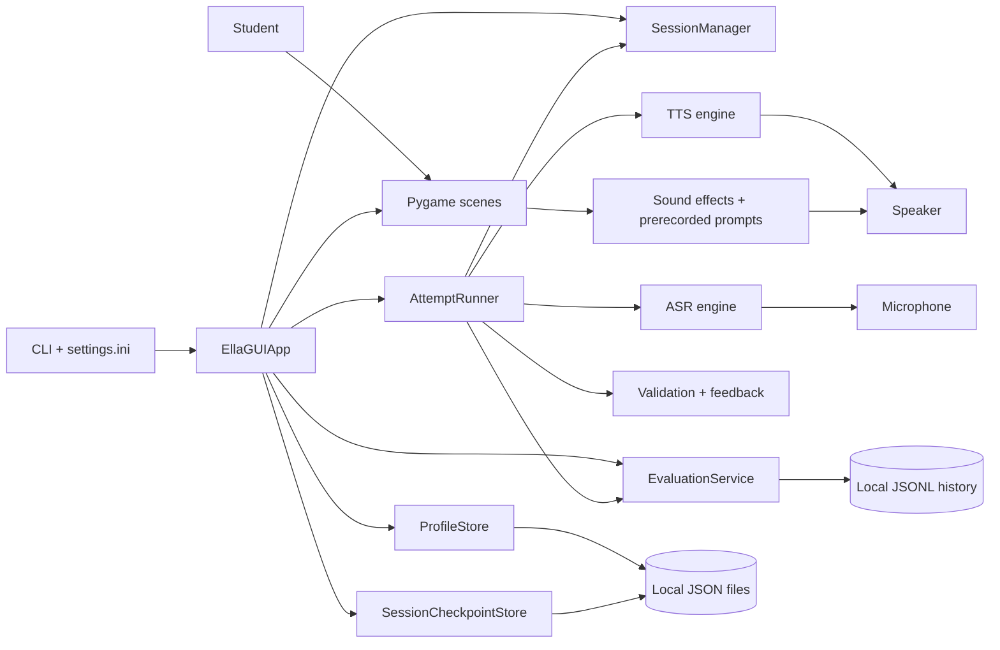
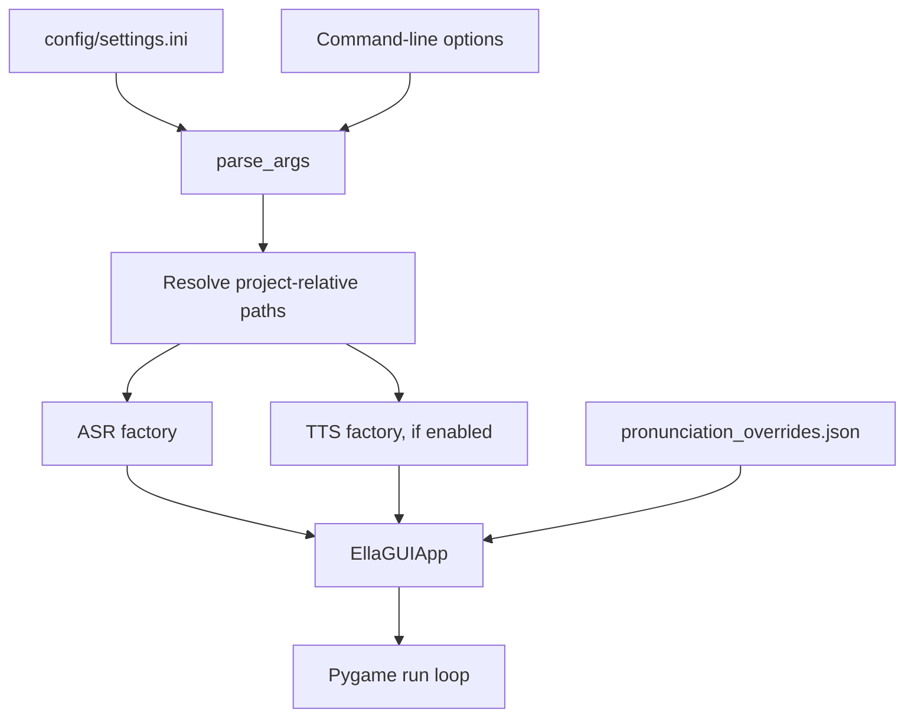
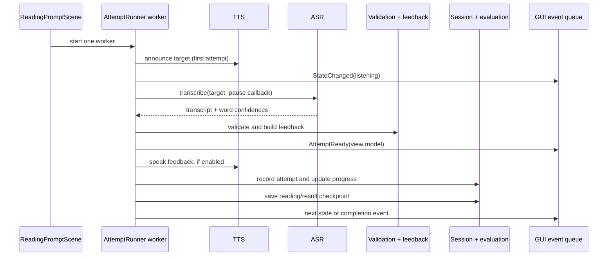
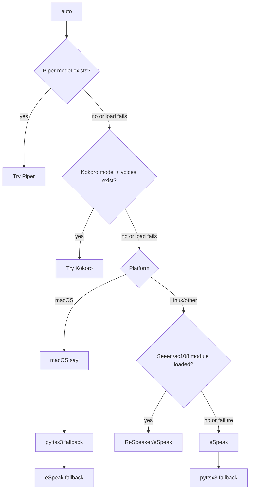
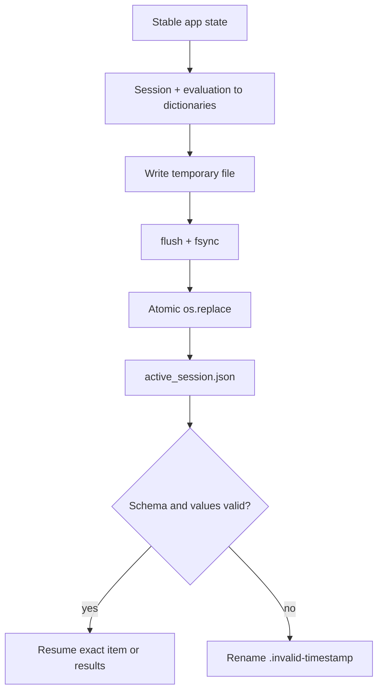
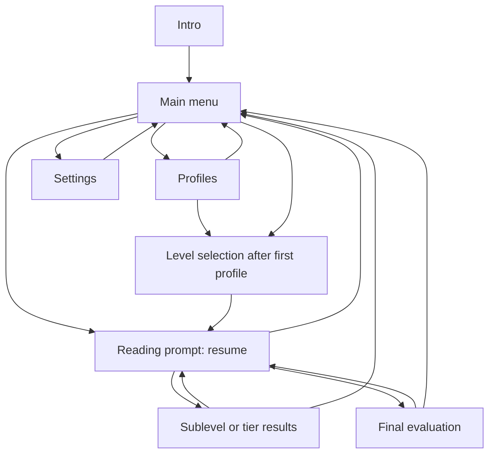

# ELLA Student Technical Handbook

This handbook explains how the ELLA offline reading assistant works. It is
written for high-school students: you do not need to be an experienced
programmer, but readers who already know Python will still find implementation
details and file references.

The descriptions in this handbook were checked against the source code and
tests present on 8 August 2026. ELLA is still being developed, so future code
may behave differently.

## Table of Contents

- [Part I — Meet ELLA](#part-i--meet-ella)
  - [Choose a reading path](#choose-a-reading-path)
  - [What ELLA does](#what-ella-does)
  - [The important vocabulary](#the-important-vocabulary)
  - [Technologies used](#technologies-used)
  - [Repository map](#repository-map)
  - [A five-minute mental model](#a-five-minute-mental-model)
  - [System architecture](#system-architecture)
  - [First walkthrough](#first-walkthrough)
- [Part II — Follow the Program](#part-ii--follow-the-program)
- [Part III — Understand the Subsystems](#part-iii--understand-the-subsystems)
- [Part IV — Work With the Project](#part-iv--work-with-the-project)
- [Part V — Repository Reference](#part-v--repository-reference)
- [Glossary](#glossary)
- [Final Architecture Recap](#final-architecture-recap)

## Part I — Meet ELLA

### Choose a reading path

You can use this handbook in different ways:

- **New coder:** Read Part I in order, follow one practice attempt in Part II,
  and use the glossary whenever a new term appears. Then try the guided tour
  and exercises in Part IV.
- **Student who knows Python:** Skim Part I, study Parts II and III, and use the
  module tables in Part V while reading the source beside this handbook.
- **Teacher or mentor:** Begin with the architecture and privacy sections, then
  choose individual subsystem chapters for lessons.

> **Reading tip:** A file path such as `src/ella_bot/services/evaluation.py`
> tells you where to look. A name such as `EvaluationService` identifies a
> class inside that file. You do not need to understand every line on your
> first reading.

### What ELLA does

ELLA is an interactive reading-practice application. A learner chooses a local
profile and a reading level. ELLA shows or plays a sound, word, phrase, or
sentence; may listen through a microphone; evaluates the response; provides
encouraging feedback; and saves progress for later.

Its curriculum moves through four broad tiers:

1. **Tier 1, levels 1A–1G:** vowels, consonants, letter combinations, and
   blends. These levels mainly use prerecorded demonstrations and practice.
2. **Tier 2, levels 2A–2D:** sight words and increasingly difficult words.
3. **Tier 3:** phrases.
4. **Tier 4:** complete sentences.

The canonical level order, thresholds, and attempt limits live in
`src/ella_bot/core/constants.py`; the actual practice pools live in
`config/level_pools.json`.

ELLA is designed to run without sending a learner's voice or progress to a
cloud service. Vosk speech recognition, Piper speech synthesis, the GUI, and
saved profiles all run locally. “Offline” describes normal operation after the
software, speech models, and dependencies have been installed. Downloading
those items initially may require internet access.

ELLA is not a general conversational artificial intelligence system. It does
not invent lessons from an online language model, diagnose speech or learning
conditions, or replace a teacher. Its decisions come from configured lesson
items and explicit Python rules.

### The important vocabulary

| Term | Beginner-friendly meaning | ELLA example |
|---|---|---|
| **Application** | A complete program a person uses. | The ELLA reading assistant. |
| **Module** | Usually one Python `.py` file containing related code. | `evaluation.py` contains evaluation data types and logic. |
| **Class** | A reusable blueprint combining data and behavior. | `ProfileStore` manages learner profiles. |
| **Service** | Code focused on one application job rather than drawing a screen. | `SessionManager` controls lesson position and progression. |
| **GUI** | Graphical user interface: screens, pictures, text, and buttons. | ELLA's Pygame interface. |
| **CLI** | Command-line interface: options typed in a terminal. | `ella-bot --start-level 2a`. |
| **ASR** | Automatic speech recognition: sound becomes text. | Vosk transcribes microphone audio. |
| **TTS** | Text-to-speech: text becomes spoken audio. | Piper reads a prompt aloud. |
| **Configuration** | Settings that change behavior without changing source code. | `listen_seconds = 8` in `settings.ini`. |
| **Persistence** | Saving data so it survives after the program closes. | Profiles, checkpoints, and history files. |
| **Event** | A small message saying that something happened. | `AttemptReady` tells the app an attempt finished. |
| **Test** | Code that checks whether other code behaves as expected. | A test verifies that a corrupt checkpoint is archived. |

### Technologies used

The package declaration in `pyproject.toml` requires Python 3.9 or newer. The
README recommends Python 3.10 or newer. Using 3.10+ is the safer student setup
because some optional speech tools may have narrower support than ELLA's own
Python code.

| Technology | Role in ELLA | Required or conditional |
|---|---|---|
| Python | Main programming language. | Required. |
| Pygame CE | Window, drawing, pointer/keyboard events, audio mixer. | Required by package metadata. |
| Vosk | Local speech-to-text model and recognizer. | Used when microphone mode is enabled. |
| `sounddevice` | Captures microphone samples for Vosk. | Used with microphone ASR. |
| Piper | Main configured local TTS engine. | Used when audio feedback selects Piper. |
| `pyttsx3`, eSpeak, macOS `say` | Alternative local TTS paths. | Platform- or configuration-dependent. |
| NumPy | Numeric audio arrays and sound processing. | Required by package metadata. |
| `pronouncing` | CMU pronunciation dictionary used for coaching hints. | Required by package metadata. |
| `rlottie-python` | Renders Lottie vector animations. | Used when compatible animation data loads. |
| OpenCV headless | Decodes video backgrounds without opening its own window. | Used for video backgrounds. |
| JSON, JSONL, INI | Text formats for lessons, progress, history, and settings. | Python's standard library reads/writes them. |
| pytest | Automated test runner. | Development dependency. |

Kokoro appears as a supported TTS choice in the code, but its package is not
declared in `pyproject.toml`. It is therefore an optional, manually installed
backend. Model files under `models/` and the Windows Piper executable under
`piper/` are runtime resources rather than ordinary Python packages.

### Repository map

This is a purpose-based map, not a list of every media file:

```text
ella-bot/
├── src/ella_bot/          Main Python package
│   ├── cli/               Startup and command-line wiring
│   ├── config/            Load and save application settings
│   ├── core/              Shared level constants and event messages
│   ├── services/          Attempts, progress, profiles, sessions, audio
│   ├── speech/            ASR/TTS interfaces, factories, and engines
│   ├── ui/                Console helper and Pygame GUI
│   ├── utils/             Path and logging helpers
│   └── validation/        Text comparison and learner feedback
├── tests/                 Automated application tests
├── config/                INI and JSON configuration/lesson data
├── assets/                Images, fonts, videos, animations, and lesson audio
├── bot/ and faces/        Robot animation frame collections
├── models/                Local speech model files (environment resources)
├── piper/                 Local Piper executable/resources
├── data/                  Generated profile registry, checkpoints, and history
├── scripts/               Audition, desktop-launch, sound, and smoke utilities
├── scratch/               Experiments and generated development previews
├── docs/                  Guides, reports, designs, and implementation plans
├── seeed-voicecard/       External Linux/ReSpeaker driver source
├── pyproject.toml         Python packaging and dependency declaration
├── README.md              Short setup and project overview
└── main.py                Deprecated compatibility launcher
```

Important boundaries:

- `src/ella_bot/` is the production application code.
- `tests/` is verification code; it is not imported during a normal lesson.
- `data/` changes while people use ELLA. Treat it as private runtime data, not
  as curriculum source.
- `scratch/` contains experiments, not supported application features.
- `docs/superpowers/` records historical designs and plans. These explain why
  changes were considered but do not override the current source.
- `seeed-voicecard` is recorded by Git as a submodule-style entry, but this
  checkout has no matching `.gitmodules` mapping. Its files are present, yet
  Git's usual `submodule` command cannot fully manage that relationship here.

The media is much larger than the Python source: `assets/` alone is about
90 MB in this checkout. Large size does not mean architectural importance;
videos and audio contain data, while Python modules contain decisions.

### A five-minute mental model

Think of ELLA as a small school team:

- The **CLI and configuration loader** prepare the classroom.
- The **Pygame app** coordinates the lesson and changes screens.
- A **scene** draws one screen and reacts to input.
- The **session manager** knows which item and level come next.
- The **attempt runner** coordinates speaking, listening, checking, and
  posting a result.
- The **ASR engine** turns microphone audio into words.
- The **validator** aligns expected and recognized words.
- The **feedback code** turns comparison details into learner-friendly text.
- The **evaluation service** summarizes attempts and ratings.
- The **profile/checkpoint stores** preserve progress safely.
- The **TTS engine and sound-effects service** produce spoken and prerecorded
  audio.

The analogy is helpful, but ownership matters technically: `EllaGUIApp` owns
the major services and current UI state; scenes receive the app and call those
services rather than constructing independent copies.

### System architecture



Arrows mean “uses” or “sends data to.” For example, the attempt runner uses an
ASR engine; the ASR engine does not control the attempt runner.

### First walkthrough

The preferred installed command is:

```bash
ella-bot
```

`pyproject.toml` maps that command to `ella_bot.cli.main:main`. The call path is:

```text
main()
  → parse_args()                         CLI values + settings.ini defaults
  → run_gui(args)
      → build_asr(args)                  simulated or Vosk
      → build_tts_if_enabled(args)       none or selected speech engine
      → load_pronunciation_overrides()
      → EllaGUIApp(...)
      → EllaGUIApp.run()                 Pygame event loop
```

The root `main.py` reaches the same function but prints a deprecation warning.
The `--gui` setting is currently parsed and loaded, yet `main()` always calls
`run_gui`; there is no active CLI branch to a console-only lesson.

Command-line values normally override defaults loaded from
`config/settings.ini` because `argparse` reads the INI values with
`set_defaults()` before parsing the command line. Not every possible
configuration value is a CLI option, and unknown keys are ignored by
`load_settings()`.

## Part II — Follow the Program

### From a terminal command to a running app

`main()` in `src/ella_bot/cli/main.py` has a deliberately small job: parse
settings and start the GUI. The work is separated so tests can check argument
parsing and engine construction without opening a real window.

The startup stages are:

1. `load_settings()` reads recognized keys from `config/settings.ini` into a
   Python dictionary.
2. `ArgumentParser.set_defaults()` uses that dictionary as the CLI defaults.
3. `parse_args()` replaces a default when the user supplies a command-line
   option.
4. `run_gui()` resolves paths and maps numeric shortcuts `1` and `2` to `1a`
   and `2a`.
5. The ASR factory constructs `SimulatedASR` or `VoskASR`.
6. If audio feedback is enabled, the TTS factory constructs a speech engine;
   otherwise the app receives `None`.
7. `EllaGUIApp` constructs the shared services, scenes, profile store, and
   runtime state, then `run()` starts Pygame.



`main()` catches any exception that escapes startup or the GUI and prints a
`[Runtime error]` message. This keeps a traceback from being the only message a
learner sees, but it also means the process does not currently return a
purpose-specific error code.

### Configuration precedence and dependency construction

**Precedence** means which setting wins when the same option appears in more
than one place:

```text
CLI option supplied by the user
        wins over
recognized value in config/settings.ini
        wins over
default written in parse_args()
```

For example, `settings.ini` currently sets an eight-second listening window.
Running `ella-bot --listen-seconds 5` changes it to five seconds for that run.
The Settings scene can persist selected values back to the INI file through
`save_setting()`.

Important current settings include:

| Section | Keys read by the application |
|---|---|
| `[System]` | `start_level`, `sentence_file`, `session_log` |
| `[Speech]` | `use_mic`, `vosk_model`, `listen_seconds`, `sample_rate`, `input_device` |
| `[TTS]` | `audio_feedback`, `tts_engine`, `tts_rate`, models, Piper synthesis values, `volume`, pronunciation overrides |
| `[GUI]` | `gui`, `fullscreen`, width, height, and left padding |

`sentence_file` is read into the defaults dictionary even though the present
CLI parser has no argument with that name. Conversely, not every internal
value is meant to be configured. This is a reminder that “present in a config
file” and “actively used by the runtime” are different claims.

Paths are resolved in three places:

- `resolve_existing_path()` tries the literal path and then the project root.
- `resolve_model_path()` in `utils/file_utils.py` puts bare model filenames
  under `models/`.
- `GUIConfig` receives an absolute or project-root-relative session log path.

A **factory** is a function that chooses and constructs an object. Factories
keep the CLI from knowing all constructor details. The ASR factory's decision
is simple: microphone mode means `VoskASR`; otherwise it creates
`SimulatedASR`. The TTS factory has more choices and fallbacks, described in
Part III.

### Core constants and immutable events

`src/ella_bot/core/constants.py` is the single Python source for:

- the ordered list of 13 levels;
- each level's pass threshold;
- the mapping from sublevel to tier;
- a maximum of one attempt per Tier 1 item and three attempts per later item;
- a ten-item session cap for Tier 2 and above.

Levels 3 and 4 have thresholds of `1.01`, which is above the maximum possible
accuracy of `1.0`. Tests explicitly call these “unreachable by threshold.”
Their completion is therefore handled through session/final-evaluation flow,
not ordinary automatic level-up based on a score above 101%.

`src/ella_bot/core/events.py` defines six frozen dataclasses:

| Event | Payload and purpose |
|---|---|
| `StateChanged` | A new robot/application state such as listening. |
| `MessageChanged` | New text for the scene to display. |
| `ErrorOccurred` | An error string that crossed a worker boundary. |
| `AttemptReady` | A completed attempt view model. |
| `SubLevelCompleted` | A result plus whether the result represents a sublevel or tier. |
| `SessionCompleted` | The final cumulative result. |

“Frozen” means code cannot replace a dataclass field after construction. That
makes an event safer to pass between threads: the sender and receiver cannot
quietly rewrite the same message. Some payloads are annotated as `Any`, so the
type checker cannot verify their exact shape; runtime tests provide part of the
contract.

`core/models.py` and `core/exceptions.py` currently contain only placeholder
statements. They are architectural space for future shared types, not active
model or error systems. This handbook does not assign them behavior they do
not have.

### The complete practice attempt

Tier 1 and later tiers intentionally follow different teaching paths.

#### Tier 1: listen and practise

Tier 1 does not ask Vosk to grade an isolated sound. Speech recognizers are
often unreliable on a single letter or phoneme, especially with children's
voices. Instead, `AttemptRunner._run_level1_practice()`:

1. selects prerecorded introduction/attention prompts;
2. plays the target WAV file when one is available;
3. falls back to a pronunciation override and TTS when needed;
4. plays a “your turn” prompt;
5. returns the screen to idle so the learner can practise;
6. records a perfect practice attempt only when the learner chooses to advance.

Replay repeats the target sound. Advancing updates evaluation and session
progress, saves a checkpoint, and starts the next demonstration.

#### Tiers 2–4: listen, recognize, evaluate

For scored reading, the attempt runner works approximately like this:



The runner considers an item correct at accuracy `>= 0.95`. A silent transcript
is still recorded as an attempt with accuracy `0.0` and WER `1.0`; it gets a
special “I didn't hear you” response instead of pronunciation coaching. Tier 1
has one attempt per item, while later tiers allow three. After the final failed
attempt, the item is marked finished and the lesson moves forward without
pretending it was correct.

`AttemptViewModel` is the bundle sent back for display. It contains expected
text, heard text, bracket-highlighted expected text, validation details, and
feedback. “View model” here means data already shaped for a screen, not a
database model.

When a sublevel ends, the runner asks `EvaluationService` for a result. It can
then save a results-phase checkpoint and emit `SubLevelCompleted`. At the end
of a tier it also produces `TierResult`. At the end of Tier 4 it produces
`SessionCompleted` and clears the active checkpoint.

## Part III — Understand the Subsystems

### How ELLA listens: ASR

An ASR engine implements one main operation:

```python
transcribe(expected_sentence=None, is_paused=None) -> ASRResult
```

`ASRResult` contains the complete `transcript` and a list of `WordScore`
objects. Each word score contains a recognized word and Vosk's confidence from
`0.0` to `1.0`. Confidence is evidence from the recognizer, not a probability
that the learner understands the word.

#### Simulated recognition

`SimulatedASR` returns the text supplied with `--spoken`. Every simulated word
gets confidence `0.9`. This path is valuable for development because it tests
the lesson flow without requiring a microphone or model.

There are similarly named ASR classes in both `asr/simulated.py` and
`asr/vosk_engine.py`. The active factory imports `SimulatedASR` from the first
file and `VoskASR` from the second. The other duplicated definitions are not
selected by `build_asr()`.

#### Vosk microphone recognition

The active `VoskASR` performs these steps:

1. Load the local Vosk model during construction.
2. Open a persistent `sounddevice.RawInputStream` for mono, signed 16-bit audio.
3. Let the audio callback place byte chunks into a thread-safe queue.
4. At the start of an attempt, discard old queued audio and create a fresh
   `KaldiRecognizer`.
5. For `listen_seconds`, take chunks from the queue and feed them to Vosk.
6. Stop early with an empty result if the pause/cancel callback becomes true.
7. Parse Vosk's final JSON into the transcript and per-word scores.
8. Log capture time, decoded audio, remaining queue backlog, decoder time, and
   word confidences.

The default stream block size is 4,000 frames. The configured sample rate is
currently 16,000 samples per second. Because each mono sample is a signed
16-bit value (two bytes), one second contains about 32,000 audio bytes.

The stream starts early to reduce delay, but that creates a possible backlog;
the diagnostics make that visible. If opening the stream fails, construction
logs an error and continues with `_stream` unset. A later transcription tries
to start it again. Missing or invalid Vosk model files instead cause a detailed
`RuntimeError` during model loading.

The ASR does not use Whisper, a cloud API, or a file named
`post_processor.py`. Correction rules that compensate for known Vosk
misrecognitions are part of `validation/validators.py`.

### How ELLA speaks: TTS and prerecorded audio

The `TTSEngine` protocol says a compatible object must have `speak(text)` and
`stop()`. The richer `BaseTTS` also supplies optional `pause()`, `resume()`,
`set_volume()`, and `current_amplitude`. The amplitude value lets robot
animation react while speech is playing.

`TTSConfig` carries voice, rate, nonblocking mode, volume, Piper model and
synthesis values, and Kokoro model paths. A TTS call is **blocking** when it
does not return until speech playback finishes. Some engines support a
nonblocking mode that uses a subprocess or background thread.

#### Engine selection

An explicit engine name constructs that backend. For `auto`, the current order
is:



Explicit Piper or Kokoro selection also falls back to `auto` when required
model files do not exist. An unsupported name raises `ValueError`.

The classic backends—eSpeak, `pyttsx3`, macOS `say`, and ReSpeaker/eSpeak—are
implemented in `speech/tts/base.py`. Several same-named files under
`speech/tts/engines/` are placeholders; Piper and Kokoro are the implemented
neural engines in that folder.

#### Piper

`PiperTTS` loads one `PiperVoice` and reuses it. It synthesizes chunks, applies
a gentle three-point finite impulse response (FIR) smoothing filter, mixes 30%
of the smoothed signal with 70% of the original, peak-normalizes the result,
and sends signed 16-bit chunks to a `sounddevice.RawOutputStream`.

The filter operation is:

```python
smoothed = np.convolve(audio, [0.25, 0.50, 0.25], mode="same")
output = 0.70 * audio + 0.30 * smoothed
```

That is a short real excerpt from `_apply_warmth()`. It softens rapid sample
changes while retaining most of the original signal. Piper also:

- maps the configured words-per-minute rate to Piper's `length_scale`;
- clamps volume during normalization;
- serializes speech with `_speak_lock`, avoiding two voices writing together;
- streams roughly 50 ms playback pieces;
- reports each piece's peak amplitude for animation;
- checks stop and pause events between pieces;
- has a special `phonemes:` path for configured IPA-like phoneme strings.

The program catches and logs errors inside Piper playback rather than letting
them escape to the whole application. This keeps the UI alive, but a failed
utterance can be silent.

#### Kokoro and system voices

`KokoroTTS` warms its ONNX model on a daemon thread, uses voice `af_heart` when
none is selected, maps 150 words per minute to speed `1.0`, and plays generated
samples through `sounddevice`. Its dependency, `kokoro-onnx`, is optional and
must be installed separately.

eSpeak, macOS `say`, and ReSpeaker launch operating-system commands.
`pyttsx3` initializes an engine for each utterance; on Windows it also attempts
to initialize COM in the calling thread. These differences explain why one
backend may work on a laptop while another is better suited to the Pi.

Prerecorded Tier 1 lesson prompts are a separate path managed by
`services/sound_effects.py`. They do not pass through neural TTS at all. That
path is explained with the attempt runner later in this part.

### How ELLA compares spoken and expected text

Validation starts by extracting sequences matching letters and apostrophes and
lowercasing them. Punctuation and digits do not become comparison tokens.

For a phrase or sentence, `align_words()` uses dynamic programming: it builds a
table of the cheapest edits needed to transform recognized words into expected
words. Each operation is recorded as:

| Operation | Meaning | Cost |
|---|---|---:|
| `equal` | Words match or an allowed equivalent matches. | 0 |
| `sub` | A recognized word replaces an expected word. | 1 |
| `del` | An expected word is missing. | 1 |
| `ins` | An extra recognized word appears. | 1 |

Word error rate (WER) and accuracy are then calculated as:

```text
edits = missing + substitutions + extra
WER = edits / number of expected words
accuracy = max(0, 1 - WER)
```

Example: expected `we read books`, recognized `we red`. The alignment can count
`red` as an allowed homophone of `read`, then mark `books` as missing. That is
one edit across three expected words: WER is about `0.333`, and accuracy is
about `0.667`.

The implementation adds curriculum-specific fairness rules:

- common strict homophones such as `to`/`two` may match;
- dropped `-ed` and possessive endings can match in selected forms;
- known Vosk phrase substitutions are reversed only when the target word
  appears in the expected text;
- a single-item lesson succeeds if the target or one of its broad configured
  ASR equivalents appears anywhere in the transcript, ignoring extra noise;
- strict fluency mode turns an otherwise matching word into an error below
  `0.35` Vosk confidence.

The single-item equivalence tables are intentionally generous for early
phonics. They should not be interpreted as a general English homophone
dictionary.

`ValidationResult` keeps WER, accuracy, missing words, incorrect pairs, extra
words, and the complete alignment. `build_highlighted_expected()` places
brackets around nonmatching expected words for simple display.

### How feedback and pronunciation coaching are built

`build_feedback()` converts validation details into a `FeedbackResult`:

- accuracy at least `0.95` receives a randomly selected success phrase;
- accuracy from `0.75` to below `0.95` receives an “almost” phrase;
- lower accuracy receives a retry phrase;
- missing, substituted, and extra words become detail strings;
- up to four hint candidates are collected, while normal spoken feedback uses
  at most two.

The phrase selection is random, so tests check categories and contents instead
of relying on one permanent sentence.

Feedback distinguishes a sound, word, phrase, or sentence. On an unsuccessful
attempt it may identify the first difficult word, speak it slowly, demonstrate
the complete target, and invite another try. Manual pronunciation overrides
come from `config/pronunciation_overrides.json`.

Overrides need careful scoping. Entries such as `go` can represent a phonics
sound in Tier 1 but an ordinary word later. `overrides_for_level()` therefore
returns the table only for Tier 1. In multiword targets, common short words and
single letters are also excluded from targeted replacement so a normal
sentence is not mangled.

If no manual form is available, `auto_pronunciation_coaching()` can query the
CMU pronunciation dictionary through `pronouncing`, translate ARPAbet symbols
to child-friendly sound chunks, or fall back to a basic vowel-based syllable
split. ARPAbet is a set of text symbols for English speech sounds; for example,
`CH` maps to “ch.” This coaching is a practical heuristic, not a complete
phonetics engine.

### Levels, tiers, attempts, passing, and progression

`SessionManager` owns the learner's current position. It receives all lesson
pools, rejects an unknown start level by falling back to `1a`, and stores an
index for every canonical level.

Tier 1 uses its complete configured pool in order. Tier 2 and later use the
entire pool when it has ten or fewer items; otherwise `random.sample()` chooses
ten distinct items for that session. The selected mini-pool is saved in the
checkpoint, so resuming does not silently draw a different set.

There are three related but different score ideas:

| Rule | Current value | Meaning |
|---|---:|---|
| Item correctness | `0.95` | Attempt runner treats this individual response as correct. |
| Evaluation pass bar | `0.70` | A finished sublevel or tier passes at 70% aggregate fluency. |
| `LEVEL_THRESHOLDS` | 0.85–1.01 | Used by `SessionManager.try_level_up()`; it is not the attempt runner's item-correct rule. |

This distinction prevents a common documentation error: there is no single
score threshold used everywhere.

The session marks an item complete when it is correct or its attempts are
exhausted. `completed_in_level` never grows beyond `level_goal`. Completion of
the final item triggers result calculation; it does not automatically erase
failed history. Retry operations reset in-memory attempts for the chosen
sublevel or tier and rebuild random session pools where appropriate.

`get_resume_level()` can infer a next level from passed sublevel records in a
JSONL file, but the current profile-aware GUI resumes exact state from a
checkpoint. The helper remains useful code, yet it is not the primary resume
mechanism wired by `EllaGUIApp`.

### Evaluation results and ratings

`EvaluationService` has no Pygame dependency. It accumulates `ItemAttempt`
records by level, calculates summaries, and appends history to JSONL.

For each distinct item, aggregation remembers:

- whether the **first** attempt was correct;
- the **best accuracy** across attempts;
- the total number of attempts.

Fluency is the arithmetic mean of each item's best accuracy. Letter ratings
use familiar bands: A at 90%+, B at 80%+, C at 70%+, D at 60%+, otherwise F.
The default pass bar is 70%. This is an application scoring scheme, not a
clinical measure of reading fluency.

Result types build on one another:

```text
ItemAttempt → SubLevelResult → TierResult → CumulativeResult
```

Sublevel history includes every item attempt. Tier history contains the
aggregate. Session history contains the overall summary, completed tier
results, start/end times, and duration. JSONL means “JSON Lines”: every line is
one complete JSON object, making append-only history practical.

Example history line (fabricated and shortened):

```json
{"type":"sublevel","session_id":"2026-08-08T10:30:00","tier":2,"level":"2a","items_total":10,"first_try_correct":8,"attempts":12,"fluency":0.91,"rating":"A","passed":true}
```

Retry clears matching in-memory scoring state. Written history is normally
append-only and is not rewritten by a retry. `reset_all()` is different: it
clears all in-memory state and attempts to delete or empty the current history
file. The GUI's profile reset feature reaches progress through the profile
store rather than asking students to edit these files manually.

### Profiles and per-student storage

`ProfileStore` keeps at most five local learner profiles in
`data/profiles.json`. A name must contain 1–20 printable characters and be
unique without regard to letter case. A profile receives a random 32-character
lowercase hexadecimal identifier and a timezone-aware creation time.

Fabricated registry example:

```json
{
  "schema_version": 1,
  "active_profile_id": "0123456789abcdef0123456789abcdef",
  "profiles": [
    {
      "id": "0123456789abcdef0123456789abcdef",
      "name": "Example Student",
      "created_at": "2026-08-08T10:30:00+08:00"
    }
  ]
}
```

Each profile gets separate progress paths:

```text
data/profiles/<profile-id>/active_session.json
data/profiles/<profile-id>/sessions.jsonl
```

Names and progress stay on the device, but “local” does not mean “public.”
Profile names, recognized words, expected text, scores, and timestamps can be
personal educational data. Do not commit real runtime data or paste it into
bug reports without permission.

Registry writes use a temporary file, flush it to storage, call `fsync()`, and
replace the old registry with `os.replace()`. This **atomic replacement** means
readers normally see the complete old file or complete new file, not half a
JSON document after a power loss.

Invalid registries are renamed with `.invalid-<timestamp>` and the store starts
empty. Resetting progress first renames the profile directory, creates a clean
replacement, and then removes the staged old data; if creation fails, it moves
the old directory back. Deletion removes the registry entry even if cleaning
the directory later fails, and reports that cleanup result to the caller.

### Saving, restoring, and recovering sessions

`SessionCheckpointStore` saves the latest stable screen state to
`active_session.json`. It supports two phases:

- `reading`: session and evaluation state, with no result payload;
- `results`: the same state plus a validated sublevel or tier result.

The document includes schema version, timezone-aware save time, selected start
level, exact session pool and indices, current expected text, scoring state,
and optional result. Restore validates exact field sets, known levels, pool
membership, numeric types, finite scores, result shape, and phase/result
consistency.



Saving is guarded by a thread lock so two saves cannot replace the same file
simultaneously. Corrupt or incompatible checkpoints are archived rather than
trusted. That recovery preserves evidence for debugging while keeping the app
from loading unsafe state.

### Threads, events, cancellation, and safe shutdown

Pygame expects window events and drawing on the main thread. Microphone capture,
recognition, and spoken feedback can take seconds, so a reading attempt runs in
a worker thread. The worker places immutable events in `app.event_queue`; the
main thread later drains and applies them.

The safe-direction rule is:

```text
worker does slow audio/validation work
       ↓ puts messages in queue
main thread changes visible GUI state
```

`AttemptRunner.abort()` sets a flag. Pause/cancel checks occur before and after
speech, while waiting, in the ASR callback path, and between audio chunks. The
runner also asks TTS to stop. A scene transition or application shutdown must
wait for the worker to finish before replacing session state or writing a final
checkpoint. Otherwise an old worker could save over a new session.

The code uses both queue events and a few shared app fields such as
`prompt_active`. This is a pragmatic design rather than perfect isolation.
Tests specifically exercise refusal to navigate or save when a worker will not
stop, because preserving learner data is more important than forcing a screen
change.

### Sound effects and prerecorded Level 1 practice

`services/sound_effects.py` handles short interface sounds and prerecorded WAV
lesson audio through Pygame's mixer. Loaded sounds are cached by path, volume,
gain, and target peak; the cache clears after it grows past 200 entries.

Quiet WAV data is processed in three stages:

1. Find the largest absolute PCM sample.
2. Normalize toward 95% of the format's maximum, scaled by volume.
3. Apply default gain `1.8`, then a hyperbolic-tangent soft limiter above 85%
   of the maximum to avoid hard clipping.

**PCM** (pulse-code modulation) represents sound as a sequence of numeric
samples. Hard clipping cuts peaks off abruptly and sounds harsh. A soft limiter
curves them toward the maximum more gradually. If NumPy/Pygame conversion
fails, the function returns the original sound instead of breaking the lesson.

For Tier 1, item resolution first looks for an exact WAV such as `b.wav`, then
for the longest filename stem contained in an item. Prompt pools provide start,
transition, attention, action, and praise phrases. Sequence selection avoids
recent repetition when possible. Missing item audio falls back to TTS; missing
prompt audio simply reduces the prerecorded sequence.

### Error paths and existing safeguards

| Failure | Current response |
|---|---|
| Missing Vosk model | Raise a detailed runtime error with the checked path and setup guidance. |
| Microphone stream cannot start | Log the problem and retry starting on transcription. |
| TTS intro/feedback fails | Post an error or fall back to a simpler feedback line where possible. |
| Attempt worker crashes | Keep the latest five error strings, post retry/message/error events, and clear `prompt_active`. |
| Empty transcript | Record a failed attempt and use dedicated no-input feedback. |
| Missing prerecorded WAV | Use TTS for the target or continue without the missing prompt. |
| Sound amplification fails | Return and play the unmodified Pygame sound. |
| Invalid profile registry/checkpoint | Archive it with an invalid timestamp suffix and ignore it. |
| Atomic checkpoint write fails | Remove the temporary file and leave the previous checkpoint in place. |
| Worker refuses to stop | Refuse unsafe navigation/final saving rather than race the worker. |

The shared logger is configured by `utils/logging.py` at `INFO` level with time,
severity, module name, and message. Some older paths still use `print()`, so
runtime output is not yet completely centralized.

### Pygame's event–update–render loop

Pygame programs redraw many times per second. `EllaGUIApp.run()` uses the
standard event–update–render pattern:

```python
# Simplified pseudocode, not a copy-paste replacement for app.py
while running:
    for event in pygame.event.get():
        active_scene.handle_event(event)
    animator.update(current_time)
    active_scene.update(current_time)
    active_scene.render()
    pygame.display.flip()
    clock.tick(configured_frames_per_second)
```

An **event** is input such as a mouse press, mouse release, key press, or window
close. **Update** advances logic and animation. **Render** draws the next frame.
`flip()` shows the completed frame, and `clock.tick(60)` limits the loop to the
configured 60 frames per second (FPS).

Startup initializes Pygame and its font module, creates a fullscreen display or
a configured-size window, caches common fonts, constructs an `AvatarAnimator`,
constructs every scene once, and activates the intro.

The event loop and the attempt event queue serve different purposes:

- `pygame.event.get()` carries operating-system and user input.
- `app.event_queue` carries ELLA's typed worker results back to the main thread.

### Scene lifecycle and screen transitions

A **scene** is one complete screen. `BaseScene` defines five lifecycle hooks:
`on_enter`, `on_exit`, `handle_event`, `update`, and `render`. Its methods are
empty defaults, so a concrete scene overrides only what it needs.

`switch_scene(name)` first asks the current scene to exit. If `on_exit()`
returns `False`, the transition is cancelled. That behavior is crucial in the
reading scene: it refuses to leave while an attempt worker remains alive.



Some arrows require conditions. Starting needs an active profile. Continuing a
saved checkpoint goes to the reading or results screen according to its saved
phase. Results advance only after a pass; the same button starts a retry after
a failed result. “Play again” on the final screen transactionally starts at
level 1A.

### The application's scenes

| Scene | Main responsibility |
|---|---|
| `IntroScene` | Play or skip a startup video, with synchronized extracted WAV audio when available. |
| `MainMenuScene` | Show the active learner, require a profile, start/resume/new-session choices, settings, profiles, and exit confirmation. |
| `ProfilesScene` | Create, rename, select, reset, or delete up to five profiles. |
| `LevelSelectionScene` | Display every canonical level and confirm before replacing live session state. |
| `ReadingPromptScene` | Display the target, start/drain attempt workers, pause safely, replay, and move through Tier 1. |
| `ResultsScene` | Show sublevel/tier results, play pass/fail sound, celebrate passes, advance or retry transactionally. |
| `FinalEvaluationScene` | Show cumulative results, celebrate, play again, or return to the menu. |
| `SettingsScene` | Change six-step volume and a 5–12 second listening window, applying and saving the values. |

The main menu deliberately checks three cases: no profiles means “create one,”
profiles but no selection means “choose one,” and an active profile may start.
If a checkpoint exists, the menu asks whether to continue or select a new
session. Choosing “new” does not destroy the old checkpoint until the new
level is confirmed and saved successfully.

The level selection scene similarly creates candidate session/evaluation
objects and saves them before replacing the active objects. This is a
**transactional** screen action: either the save succeeds and the app changes,
or it stays with the earlier valid state.

#### An important legacy section

`ReadingPromptScene` still contains an older `_attempt_worker()` method that
uses tuple events and directly duplicates validation/progression logic. The
live `_start_attempt()` target is `self.runner.run`, so the service-based
`AttemptRunner` described earlier is the active path. The queue drain handles
typed dataclass events, not those old tuples. Students should not use the
legacy method as the architectural source of truth.

### Buttons, the on-screen keyboard, modals, and confetti

`components/button.py` provides a pill-shaped `Button` with yellow, violet, and
dark-violet themes. It records a press only when the pointer goes down inside;
it activates only when release also occurs inside. This prevents a drag away
from becoming an accidental action. Oversized label surfaces are scaled into
the button, then optically centered using their visible pixel bounds.

The profile keyboard has three letter rows plus Shift, apostrophe, Space,
hyphen, and Back. Keys have weights, so Space is wider. Shift affects only the
next letter and then resets. Releasing outside the key cancels the action.
Physical `TEXTINPUT`, Backspace, Enter, and Escape continue to work, so the
touch keyboard supplements rather than removes laptop input.

`PauseModal` overlays the reading screen and provides:

- resume/close;
- the same volume and listening-time controls;
- restart-level and back-to-menu actions;
- an extra confirmation screen for destructive-in-context actions.

Restart and menu operations first abort and join the worker, then save. If
saving fails, the scene restores the checkpoint and remains paused.

`ConfettiAnimation` prefers vector frames from the USA confetti Lottie file and
also runs a particle fallback. Particle position changes through velocity,
gravity, rotation, and a sine-wave flutter. It stops and clears particles after
its duration. This is decorative feedback only; pass/fail decisions come from
`EvaluationService`.

### Robot animation and application state

There are two animation abstractions:

- `AvatarAnimator` is owned by `EllaGUIApp`. It loads the `faces/` state
  folders (or an older `assets/avatars/ella_default` layout) and can generate
  simple drawn fallback faces.
- `BotSprite` is owned by the main-menu and reading scenes. It prefers talking
  PNG frames for speech, Robot SVG frames for idle, and `bot/` state folders as
  fallbacks. It caches scaled frames for the current target size.

Worker states map to visuals: `processing` becomes BotSprite's `thinking`, and
`success`/`retry` return its pose to idle. During Piper speech, nonzero
`current_amplitude` directly selects a mouth frame; otherwise the frame changes
on a timer. This makes speech animation react to actual output level.

The global `AvatarAnimator` is still updated every frame even though prominent
screens also own `BotSprite`. This is overlapping historical architecture,
not one unified sprite system.

### Lottie, video, images, fonts, and fallbacks

ELLA uses a fallback chain because Raspberry Pi graphics/library support can
vary:

```text
working Lottie candidate
        ↓ otherwise
streaming MP4 VideoBackground
        ↓ otherwise
scene-specific static image or solid fill
```

`LottieBackground` uses `rlottie-python`. It prefers already extracted JSON;
otherwise it can extract JSON from a `.lottie` ZIP archive. It supports loop,
ping-pong, and crossfade indexing, caches the current frame and scaled version,
and returns `None` on render failure.

`VideoBackground` uses OpenCV. It decodes the desired MP4 frame on demand,
seeks when playback is no longer sequential, converts BGR pixels to RGB, and
caches scaling. This avoids loading an entire background video into memory.

The intro is different: `IntroScene` decodes all video frames into Pygame
surfaces once. It tries `assets/SS_ELLA.mp4` first and falls back through older
intro filenames. If a matching WAV is absent, it may invoke FFmpeg to extract
stereo 44.1 kHz PCM audio. Missing video immediately advances to the menu, and
any mouse/key press skips playback.

Fonts prefer the bundled Changa One TTF for interface text, then common system
families. Reading prompts intentionally request Arial. Icons and backgrounds
have scene-specific SVG/PNG alternatives; failure usually produces a simpler
screen rather than terminating the app.

One current path issue is worth noticing: the reading scene first calls
`resolve_config_path("assets/Reading_bg.lottie")`, which points under
`config/assets/`; it then falls back to the process-relative
`assets/Reading_bg.lottie`. Launching from the project root makes that fallback
work, but the first resolution is inconsistent with other asset helpers.

### Responsive layout and touch input

Most scenes read `screen.get_size()` each render and calculate rectangles from
the actual width and height. Reusable techniques include:

- scaling text surfaces when labels exceed a maximum box;
- wrapping long prompt text;
- trying reading-prompt font sizes from 82 down to 12 until text fits above
  the robot's safe boundary;
- computing profile keyboard rows inside a supplied bounds rectangle;
- sizing modal cards within available screen margins;
- scaling media while preserving or covering aspect ratio.

`left_padding` is a global calibration offset. After a scene finishes drawing,
the app scrolls the frame to the right and fills the new left strip black. It
subtracts the same amount from mouse-event x coordinates. Moving both pixels
and pointer coordinates together keeps taps aligned with visible buttons.

Pygame mouse events also represent touchscreen taps on supported systems. The
code generally uses press-and-release tracking rather than acting on press
alone. The Settings and profile scenes demonstrate how this supports safe touch
interaction.

Accessibility limitations remain. The interface is heavily visual, custom
buttons are not exposed as semantic controls to a screen reader, many colors
are fixed, and the primary flow assumes speech/hearing. Large controls,
adaptive text, replay, adjustable listening time, keyboard alternatives, and
offline privacy help, but they do not make the app universally accessible.

### GUI failure handling and shutdown

`run()` uses nested `finally` blocks: it calls `shutdown()` and then
`pygame.quit()` even after a runtime exception. `shutdown()` asks the active
scene to quiesce first, then saves an active, started profile session.

The reading scene gives a worker two seconds to join. If it remains alive,
`on_exit()`/`prepare_shutdown()` return `False`. Normal `switch_scene()` honors
that result. A process-level window close sets `running = False`; the finalizer
still invokes the shutdown attempt before quitting Pygame.

Media helpers catch missing libraries/files and report falsey/`None` objects.
Scenes test those objects and use fallback drawing. Button and text renderers
also check that mocked or real font calls produced actual Pygame surfaces,
which makes both runtime degradation and headless testing safer.

## Part IV — Work With the Project

## Part V — Repository Reference

## Glossary

## Final Architecture Recap
