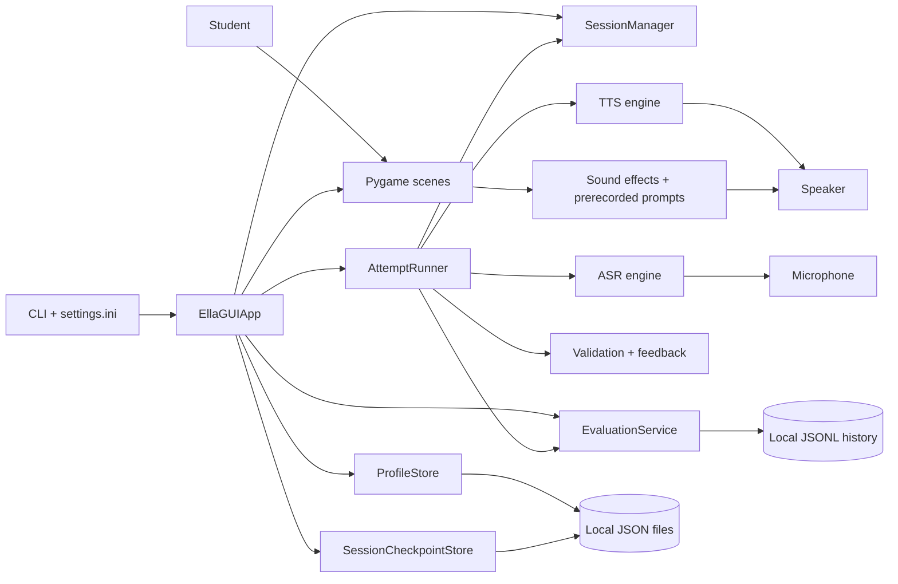

# ELLA Student Technical Handbook

This handbook explains how the ELLA offline reading assistant works. It is
written for high-school students: you do not need to be an experienced
programmer, but readers who already know Python will still find implementation
details and file references.

The descriptions in this handbook were checked against the source code and
tests present on 8 August 2026. ELLA is still being developed, so future code
may behave differently.

## Table of Contents

- [Part I — Meet ELLA](#part-i--meet-ella)
  - [Choose a reading path](#choose-a-reading-path)
  - [What ELLA does](#what-ella-does)
  - [The important vocabulary](#the-important-vocabulary)
  - [Technologies used](#technologies-used)
  - [Repository map](#repository-map)
  - [A five-minute mental model](#a-five-minute-mental-model)
  - [System architecture](#system-architecture)
  - [First walkthrough](#first-walkthrough)
- [Part II — Follow the Program](#part-ii--follow-the-program)
- [Part III — Understand the Subsystems](#part-iii--understand-the-subsystems)
- [Part IV — Work With the Project](#part-iv--work-with-the-project)
- [Part V — Repository Reference](#part-v--repository-reference)
- [Glossary](#glossary)
- [Final Architecture Recap](#final-architecture-recap)

## Part I — Meet ELLA

### Choose a reading path

You can use this handbook in different ways:

- **New coder:** Read Part I in order, follow one practice attempt in Part II,
  and use the glossary whenever a new term appears. Then try the guided tour
  and exercises in Part IV.
- **Student who knows Python:** Skim Part I, study Parts II and III, and use the
  module tables in Part V while reading the source beside this handbook.
- **Teacher or mentor:** Begin with the architecture and privacy sections, then
  choose individual subsystem chapters for lessons.

> **Reading tip:** A file path such as `src/ella_bot/services/evaluation.py`
> tells you where to look. A name such as `EvaluationService` identifies a
> class inside that file. You do not need to understand every line on your
> first reading.

### What ELLA does

ELLA is an interactive reading-practice application. A learner chooses a local
profile and a reading level. ELLA shows or plays a sound, word, phrase, or
sentence; may listen through a microphone; evaluates the response; provides
encouraging feedback; and saves progress for later.

Its curriculum moves through four broad tiers:

1. **Tier 1, levels 1A–1G:** vowels, consonants, letter combinations, and
   blends. These levels mainly use prerecorded demonstrations and practice.
2. **Tier 2, levels 2A–2D:** sight words and increasingly difficult words.
3. **Tier 3:** phrases.
4. **Tier 4:** complete sentences.

The canonical level order, thresholds, and attempt limits live in
`src/ella_bot/core/constants.py`; the actual practice pools live in
`config/level_pools.json`.

ELLA is designed to run without sending a learner's voice or progress to a
cloud service. Vosk speech recognition, Piper speech synthesis, the GUI, and
saved profiles all run locally. “Offline” describes normal operation after the
software, speech models, and dependencies have been installed. Downloading
those items initially may require internet access.

ELLA is not a general conversational artificial intelligence system. It does
not invent lessons from an online language model, diagnose speech or learning
conditions, or replace a teacher. Its decisions come from configured lesson
items and explicit Python rules.

### The important vocabulary

| Term | Beginner-friendly meaning | ELLA example |
|---|---|---|
| **Application** | A complete program a person uses. | The ELLA reading assistant. |
| **Module** | Usually one Python `.py` file containing related code. | `evaluation.py` contains evaluation data types and logic. |
| **Class** | A reusable blueprint combining data and behavior. | `ProfileStore` manages learner profiles. |
| **Service** | Code focused on one application job rather than drawing a screen. | `SessionManager` controls lesson position and progression. |
| **GUI** | Graphical user interface: screens, pictures, text, and buttons. | ELLA's Pygame interface. |
| **CLI** | Command-line interface: options typed in a terminal. | `ella-bot --start-level 2a`. |
| **ASR** | Automatic speech recognition: sound becomes text. | Vosk transcribes microphone audio. |
| **TTS** | Text-to-speech: text becomes spoken audio. | Piper reads a prompt aloud. |
| **Configuration** | Settings that change behavior without changing source code. | `listen_seconds = 8` in `settings.ini`. |
| **Persistence** | Saving data so it survives after the program closes. | Profiles, checkpoints, and history files. |
| **Event** | A small message saying that something happened. | `AttemptReady` tells the app an attempt finished. |
| **Test** | Code that checks whether other code behaves as expected. | A test verifies that a corrupt checkpoint is archived. |

### Technologies used

The package declaration in `pyproject.toml` requires Python 3.9 or newer. The
README recommends Python 3.10 or newer. Using 3.10+ is the safer student setup
because some optional speech tools may have narrower support than ELLA's own
Python code.

| Technology | Role in ELLA | Required or conditional |
|---|---|---|
| Python | Main programming language. | Required. |
| Pygame CE | Window, drawing, pointer/keyboard events, audio mixer. | Required by package metadata. |
| Vosk | Local speech-to-text model and recognizer. | Used when microphone mode is enabled. |
| `sounddevice` | Captures microphone samples for Vosk. | Used with microphone ASR. |
| Piper | Main configured local TTS engine. | Used when audio feedback selects Piper. |
| `pyttsx3`, eSpeak, macOS `say` | Alternative local TTS paths. | Platform- or configuration-dependent. |
| NumPy | Numeric audio arrays and sound processing. | Required by package metadata. |
| `pronouncing` | CMU pronunciation dictionary used for coaching hints. | Required by package metadata. |
| `rlottie-python` | Renders Lottie vector animations. | Used when compatible animation data loads. |
| OpenCV headless | Decodes video backgrounds without opening its own window. | Used for video backgrounds. |
| JSON, JSONL, INI | Text formats for lessons, progress, history, and settings. | Python's standard library reads/writes them. |
| pytest | Automated test runner. | Development dependency. |

Kokoro appears as a supported TTS choice in the code, but its package is not
declared in `pyproject.toml`. It is therefore an optional, manually installed
backend. Model files under `models/` and the Windows Piper executable under
`piper/` are runtime resources rather than ordinary Python packages.

### Repository map

This is a purpose-based map, not a list of every media file:

```text
ella-bot/
├── src/ella_bot/          Main Python package
│   ├── cli/               Startup and command-line wiring
│   ├── config/            Load and save application settings
│   ├── core/              Shared level constants and event messages
│   ├── services/          Attempts, progress, profiles, sessions, audio
│   ├── speech/            ASR/TTS interfaces, factories, and engines
│   ├── ui/                Console helper and Pygame GUI
│   ├── utils/             Path and logging helpers
│   └── validation/        Text comparison and learner feedback
├── tests/                 Automated application tests
├── config/                INI and JSON configuration/lesson data
├── assets/                Images, fonts, videos, animations, and lesson audio
├── bot/ and faces/        Robot animation frame collections
├── models/                Local speech model files (environment resources)
├── piper/                 Local Piper executable/resources
├── data/                  Generated profile registry, checkpoints, and history
├── scripts/               Audition, desktop-launch, sound, and smoke utilities
├── scratch/               Experiments and generated development previews
├── docs/                  Guides, reports, designs, and implementation plans
├── seeed-voicecard/       External Linux/ReSpeaker driver source
├── pyproject.toml         Python packaging and dependency declaration
├── README.md              Short setup and project overview
└── main.py                Deprecated compatibility launcher
```

Important boundaries:

- `src/ella_bot/` is the production application code.
- `tests/` is verification code; it is not imported during a normal lesson.
- `data/` changes while people use ELLA. Treat it as private runtime data, not
  as curriculum source.
- `scratch/` contains experiments, not supported application features.
- `docs/superpowers/` records historical designs and plans. These explain why
  changes were considered but do not override the current source.
- `seeed-voicecard` is recorded by Git as a submodule-style entry, but this
  checkout has no matching `.gitmodules` mapping. Its files are present, yet
  Git's usual `submodule` command cannot fully manage that relationship here.

The media is much larger than the Python source: `assets/` alone is about
90 MB in this checkout. Large size does not mean architectural importance;
videos and audio contain data, while Python modules contain decisions.

### A five-minute mental model

Think of ELLA as a small school team:

- The **CLI and configuration loader** prepare the classroom.
- The **Pygame app** coordinates the lesson and changes screens.
- A **scene** draws one screen and reacts to input.
- The **session manager** knows which item and level come next.
- The **attempt runner** coordinates speaking, listening, checking, and
  posting a result.
- The **ASR engine** turns microphone audio into words.
- The **validator** aligns expected and recognized words.
- The **feedback code** turns comparison details into learner-friendly text.
- The **evaluation service** summarizes attempts and ratings.
- The **profile/checkpoint stores** preserve progress safely.
- The **TTS engine and sound-effects service** produce spoken and prerecorded
  audio.

The analogy is helpful, but ownership matters technically: `EllaGUIApp` owns
the major services and current UI state; scenes receive the app and call those
services rather than constructing independent copies.

### System architecture



Arrows mean “uses” or “sends data to.” For example, the attempt runner uses an
ASR engine; the ASR engine does not control the attempt runner.

### First walkthrough

The preferred installed command is:

```bash
ella-bot
```

`pyproject.toml` maps that command to `ella_bot.cli.main:main`. The call path is:

```text
main()
  → parse_args()                         CLI values + settings.ini defaults
  → run_gui(args)
      → build_asr(args)                  simulated or Vosk
      → build_tts_if_enabled(args)       none or selected speech engine
      → load_pronunciation_overrides()
      → EllaGUIApp(...)
      → EllaGUIApp.run()                 Pygame event loop
```

The root `main.py` reaches the same function but prints a deprecation warning.
The `--gui` setting is currently parsed and loaded, yet `main()` always calls
`run_gui`; there is no active CLI branch to a console-only lesson.

Command-line values normally override defaults loaded from
`config/settings.ini` because `argparse` reads the INI values with
`set_defaults()` before parsing the command line. Not every possible
configuration value is a CLI option, and unknown keys are ignored by
`load_settings()`.

## Part II — Follow the Program

## Part III — Understand the Subsystems

## Part IV — Work With the Project

## Part V — Repository Reference

## Glossary

## Final Architecture Recap
