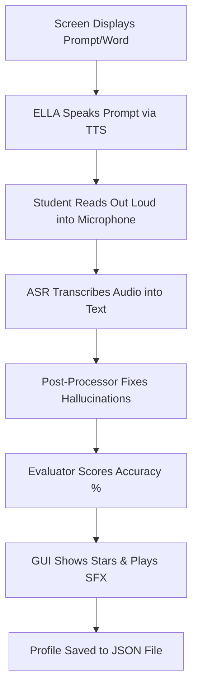
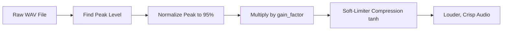

# 🤖 ELLA (English Language Learning Assistant)
## High School Student Developer & Technical Guide

Welcome to the **ELLA** codebase documentation! This guide was written specifically for students who want to understand how a real-world, offline AI learning assistant works under the hood. 

Whether you are already writing code or just curious about how computer science, artificial intelligence, and audio engineering work together, this document will take you step-by-step through how ELLA thinks, listens, speaks, and draws its user interface.

---

## 📌 Table of Contents
1. [What is ELLA? (High-Level Overview)](#1-what-is-ella-high-level-overview)
2. [System Architecture (How the Parts Fit Together)](#2-system-architecture)
3. [The Voice Engine: How ELLA Speaks (Text-to-Speech / TTS)](#3-the-voice-engine-how-ella-speaks-tts)
4. [The Ears: How ELLA Listens (Automatic Speech Recognition / ASR)](#4-the-ears-how-ella-listens-asr)
5. [The Judge: How ELLA Grades Your Reading (Speech Evaluation)](#5-the-judge-how-ella-grades-your-reading)
6. [The Display: How the Screen & Buttons Work (Pygame GUI)](#6-the-display-how-the-screen--buttons-work)
7. [The Sound Lab: Audio Amplification & Math (Signal Processing)](#7-the-sound-lab-audio-amplification--math)
8. [Memory & Progress: How Profiles Are Saved (JSON Storage)](#8-memory--progress-how-profiles-are-saved)
9. [Hardware: Running on a Raspberry Pi 5](#9-hardware-running-on-a-raspberry-pi-5)
10. [Glossary of Tech Terms](#10-glossary-of-tech-terms)

---

## 1. What is ELLA? (High-Level Overview)

**ELLA** stands for **English Language Learning Assistant**. It is an interactive educational app designed to help students improve their reading, phonics, and pronunciation skills.

### 🌟 Key Goals of ELLA
* **100% Offline Capability**: ELLA does not require the internet! All speech recognition, voice synthesis, and grading happen directly on the device (like a Raspberry Pi 5).
* **Instant Feedback**: Reads phonemes, words, and passages with you, giving immediate encouraging feedback and star ratings.
* **Fair & Accurate Grading**: Uses smart algorithms to ignore minor speech recognition slips (like hearing "ana" when you said "and I").

---

## 2. System Architecture

Think of ELLA like a human body:
* **The Mouth (TTS)**: Converts text into spoken audio.
* **The Ears (ASR)**: Converts your spoken voice into text.
* **The Brain (Evaluator & Profile Store)**: Compares what you said against the target text and updates your student progress.
* **The Face (Pygame GUI)**: Displays the screens, buttons, animations, and star rewards.

### 🔄 The Student Practice Loop



---

## 3. The Voice Engine: How ELLA Speaks (TTS)

* **Main File**: `src/ella_bot/speech/tts/engines/piper.py`

### How It Works
ELLA uses **Piper TTS**, a fast neural network text-to-speech model.
1. **Text Input**: ELLA receives text like `"Let's practice the /ch/ sound!"`.
2. **Neural Model**: Piper translates the characters into phonetic sounds and generates digital sound waves (PCM samples).
3. **Warmth & Clarity Filter (`_apply_warmth`)**: To prevent the voice from sounding tinny or harsh through small robot speakers, ELLA passes the sound through a gentle low-pass filter:

```python
# A simple mathematical filter that smooths out sharp high-pitched digital harshness
smoothed = np.convolve(audio, filter_weights, mode="same")
output = 0.70 * audio + 0.30 * smoothed
```

---

## 4. The Ears: How ELLA Listens (ASR)

* **Main Files**: `src/ella_bot/speech/asr/` & `src/ella_bot/speech/asr/post_processor.py`

### How It Works
1. **Microphone Capture**: Pygame/SoundDevice records your voice when you hold or press the reading button.
2. **Offline Speech-to-Text**: ELLA uses **Whisper** (via `faster-whisper`), an artificial intelligence model trained on thousands of hours of speech.
3. **Post-Processing (Fixing "AI Hallucinations")**: Offline speech recognition on small devices can sometimes mishear spoken words. For example:
   * Student says: `"and I went to the store"`
   * ASR raw output: `"ana went to the store"`
   
   ELLA's `post_processor.py` detects common phonetic mishearings and converts `"ana"` back to `"and I"` before grading, making sure you get fair scores!

---

## 5. The Judge: How ELLA Grades Your Reading

* **Main File**: `src/ella_bot/services/evaluation.py`

### The Levenshtein Distance Algorithm
How does a computer compare two sentences to see how similar they are? ELLA uses **Levenshtein Distance** (Edit Distance math).

Imagine you have two words:
* Target: `CAT`
* Spoken: `BAT`

The edit distance is **1** (replace 'C' with 'B').

$$\text{Accuracy Percentage} = \left( 1 - \frac{\text{Edit Distance}}{\text{Length of Target Text}} \right) \times 100\%$$

If your accuracy is:
* **85% or higher**: 3 Stars ⭐⭐⭐ (Excellent!)
* **70% - 84%**: 2 Stars ⭐⭐ (Good job!)
* **50% - 69%**: 1 Star ⭐ (Keep practicing!)

---

## 6. The Display: How the Screen & Buttons Work

* **Main Files**: `src/ella_bot/ui/pygame_gui/`

ELLA's graphical interface is built using **Pygame**.

### Key GUI Features
1. **Scene Manager**: Controls which screen is currently visible (`IntroScene`, `MainMenuScene`, `ProfilesScene`, `Level1PracticeScene`, `ResultsScene`).
2. **Adaptive Text Scaling (`_get_adaptive_font`)**: Keeps text labels looking neat on any resolution screen (from high school laptop displays to 7-inch Raspberry Pi touchscreens). If a button label is too long, ELLA automatically scales the font size down so it never overflows out of the button!
3. **Confetti & Particle Effects**: When you complete a reading level, a particle system spawns dozens of colorful bouncing confetti pieces using physics math:

$$\text{Position}_{new} = \text{Position}_{old} + \text{Velocity} \times \Delta t$$

---

## 7. The Sound Lab: Audio Amplification & Math

* **Main File**: `src/ella_bot/services/sound_effects.py`

Pre-recorded WAV prompt files are sometimes recorded quietly. ELLA includes a custom Digital Signal Processing (DSP) engine to boost loudness cleanly.

### The Amplification Math



1. **Peak Normalization**: Finds the single loudest sample in the sound file and scales the whole file up so the peak reaches 95% of maximum volume.
2. **Gain Factor Scaling**: Multiplies the volume by `DEFAULT_GAIN_FACTOR = 1.8` (or your custom setting).
3. **Soft-Limiter (`tanh` Compression)**: If boosting volume makes the audio exceed maximum digital capacity (32,767), standard systems produce ugly static crackling (hard digital clipping). ELLA uses the hyperbolic tangent curve (`tanh`) to compress loud peaks smoothly:

```python
# Tanh Soft-Limiter Curve
compressed = threshold + (max_int - threshold) * np.tanh((val - threshold) / (max_int - threshold))
```

This makes quiet recordings **3x to 4x louder** while keeping the audio crystal clear!

---

## 8. Memory & Progress: How Profiles Are Saved

* **Main File**: `src/ella_bot/services/profile_store.py`

Student data (unlocked levels, total stars earned, high scores, and audition level progress) is stored locally in human-readable **JSON** files.

### Example Profile JSON (`profiles.json`)
```json
{
  "profiles": [
    {
      "id": "student_01",
      "name": "Alex",
      "unlocked_level": 3,
      "total_stars": 24,
      "scores": {
        "level_1_item_1": 95,
        "level_1_item_2": 88
      }
    }
  ]
}
```

---

## 9. Hardware: Running on a Raspberry Pi 5

ELLA is optimized to run smoothly on a **Raspberry Pi 5** single-board computer!

* **Audio Hardware**: Uses a **Seeed Voicecard** (Dual-microphone HAT) for noise-canceling microphone input and crisp speaker output.
* **Performance Tuning**:
  * Neural models (Piper & Whisper) are pre-loaded into RAM once at startup so there is zero lag when speaking or listening.
  * Audio playback runs in non-blocking background threads so the UI stays smooth at 30-60 Frames Per Second (FPS).

---

## 10. Glossary of Tech Terms

* **ASR (Automatic Speech Recognition)**: Software that converts spoken audio into written text.
* **TTS (Text-to-Speech)**: Software that converts written text into synthetic human speech.
* **PCM (Pulse-Code Modulation)**: The standard digital representation of uncompressed audio waves.
* **Pygame**: A popular Python library used for building 2D games and graphical interfaces.
* **Levenshtein Distance**: A mathematical measurement of how many single-character edits are needed to change one word/sentence into another.
* **Soft Limiter**: An audio engineering technique that smooths out overly loud sound peaks to prevent harsh digital distortion.
* **JSON (JavaScript Object Notation)**: A lightweight, text-based data format used to save and exchange structured information.

---

*Made with ❤️ for future computer scientists and engineers!*
